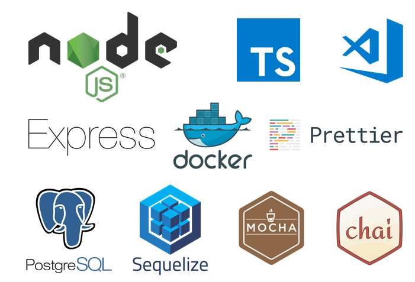

# The node.js message broker app (WIP)

Message broker application that allows multiple appplication to publish and subscribe messages to the main broker.



Two messaging models are supported: queuing and publish-subscribe. 
 - in a queue, a pool of consumers may read from the broker and each record goes to one of them
    - message
 - in publish-subscribe the messages are broadcasted to all subscribed consumers
 - the consumer

Supported actions: 
- broker can:
    - receive messages from publishers and store them for future consumption
    - add/remove message consumers
    - on a request from given consumer to send him all the messages
    - on his own to be able to send all the messages all the subscribed consumers
- consumser can:
    - subscribe/unsubscribe to the broker
    - consume messages from the broker (initiated by the consumer)
    - receive messages from the broker 
        - when the broker wants to broadcast the messages to all consumsers (initiated by the broker)
- producer can:
    - publish messages to the broker

## Steps for startup of the apps

To start the broker app, run the following in separate terminals

```bash
npm run broker
npm run firstProducer
npm run firstConsumer
```

For development
```bash
tsc -w
docker build -t node-broker .
docker build -t node-first-consumer -f ./consumer/Dockerfile .
docker run -it -p 3000:3000 node-broker
```

## Used technologies
* node.js
* express.js
* typescript
* postgre
* docker

Made with ❤️ by Kristian
