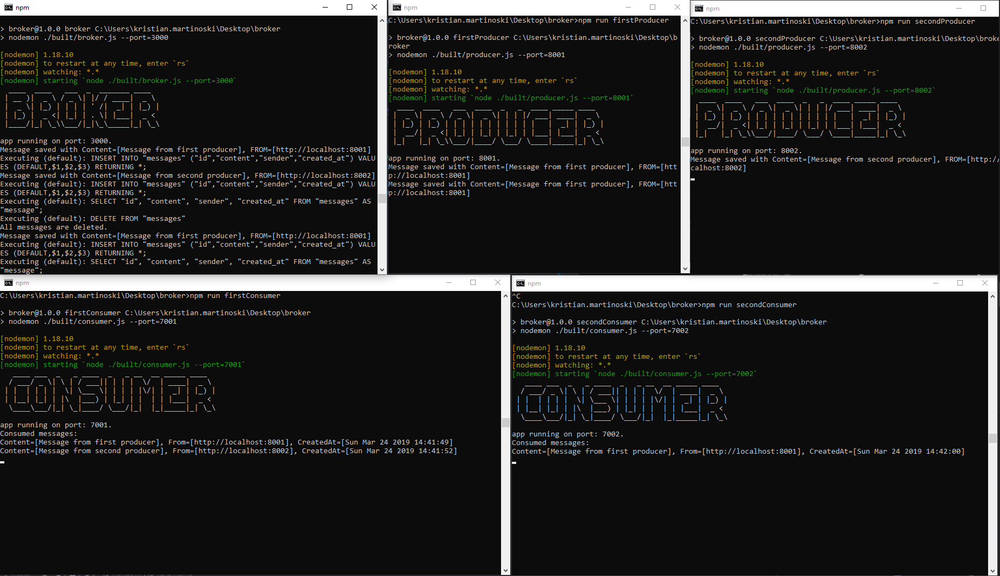
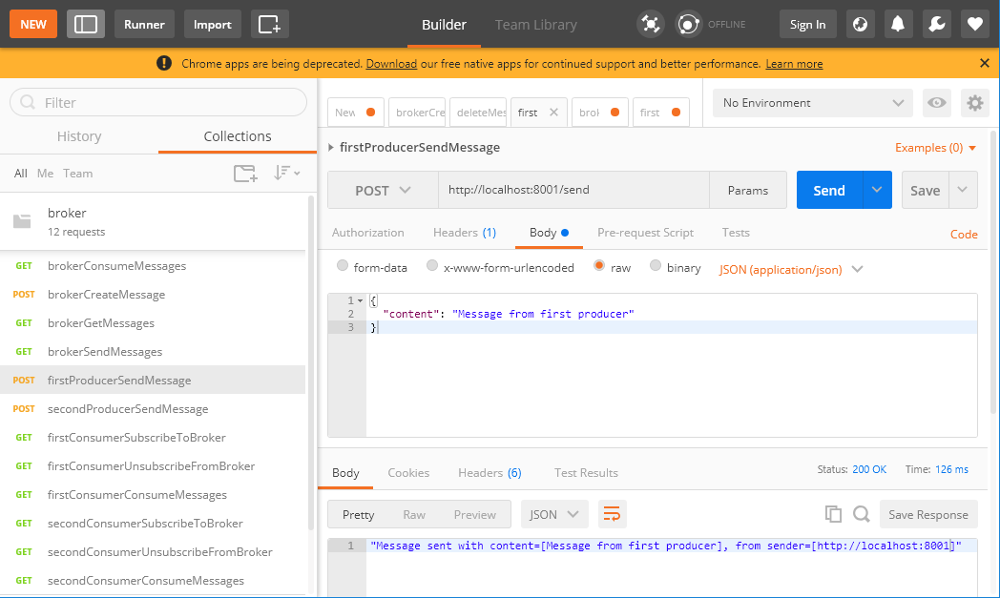

# Message broker app

Message **broker** is a **Node.JS** application that allows multiple **producers** and **consumers** to send and receive messages. Two messaging models are supported: 
- **queueing**
    - asynchronous communication, the producer and consumer of the message do not need to interact with the broker at the same time. Messages in the broker are stored until a given consumer retrieves them.
- **publish-subscribe** 
    - broker keeps a list of the subscribed consumers, but when a message is received it is not sent immediately to all the consumers. Instead he exposes send operation where all the stored messages are broadcasted to all the subscribed consumers.

Supported actions: 
- **Broker:**
    - receive messages from publishers and store them for future consumption
    - add/remove message consumers
    - on a request from given consumer to send him all the messages
    - on his own to send the messages to the subscribed consumers

- **Producer:**
    - send messages to the broker

- **Consumer:**
    - consume messages from the broker (initiated by the consumer)
    - subscribe/unsubscribe to the broker
    - receive messages from the broker (initiated by the broker)
        - when the broker wants to broadcast the messages to the subscribed consumers

## Broker with 2 publishers and 2 subscribers


## Postman ([collection here](postman/broker.postman_collection.json))


# Tech stack


## Database
- the messages in the broker are persisted in **PostgreSQL** instance hosted on **Heroku**
- the db contains only one table for messages (id, content, sender, created_at)
- the data access is through [Sequelize](http://docs.sequelizejs.com/) (Node.js ORM for PostgreSQL)

## Commands

To install the dependencies: ```npm install``` and to build the typescript files: ```tsc -w```

To start broker, 2 producers and 2 consumers in separate terminals run:

```bash
npm run broker
npm run firstProducer
npm run secondProducer
npm run firstConsumer
npm run secondConsumer
```
To run the tests: 
```bash
npm run testBroker
npm run testProducer
npm run testConsumer
```
### Docker:
```bash
docker build -t node-broker .
docker run -it -p 3000:3000 node-broker
```
To build the first consumer and producer:
```bash
docker build -t node-first-consumer -f ./consumer/Dockerfile .
docker build -t node-first-producer -f ./producer/Dockerfile .
```
Made with ❤️ by Kristian Martinoski